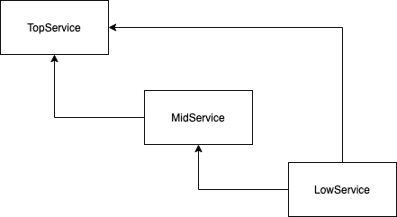

I was curious if Quarkus' test mechanism with injected mocks could handle a contrived mixture of inter-related services that were each "real" in one test and mocked in the others.

The contrived services and their relationships are



From the [@InjectMock section of the Quarkus Guides](https://quarkus.io/guides/getting-started-testing#further-simplification-with-injectmock), this experiment uses a combination of `@Inject` and `@InjectMock` to confirm the CDI context "swaps in and out" the real and mock services even though the Quarkus application context is started once.

## Try it out

```shell
./gradelw test
```

